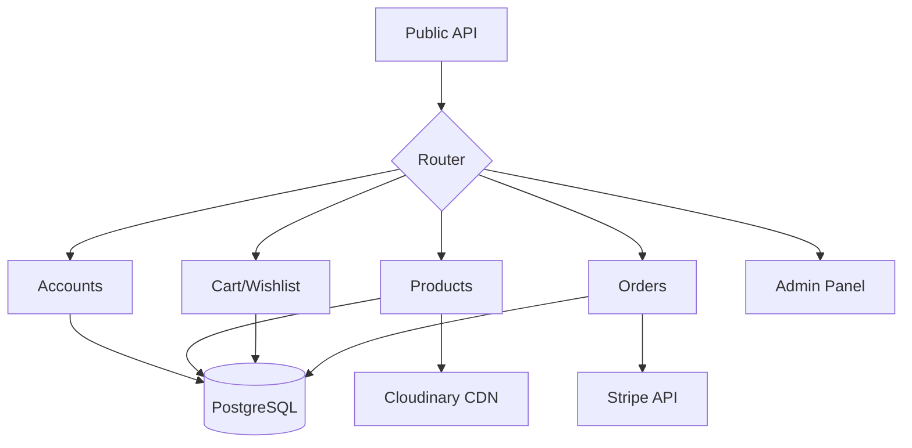

<div align="center">

# 🛍️ Souled Store - Backend

### Modern E-Commerce API Engine built with Django REST Framework

[](https://www.djangoproject.com/)
[](https://www.django-rest-framework.org/)
[](https://www.postgresql.org/)
[](https://www.python.org/)

**A production-ready infrastructure** featuring JWT authentication, Stripe payment integration, and cloud-optimized media storage.

[Features](#-key-capabilities) • [Deployment](#-deployment-ready) • [Tech Stack](#-technology-stack)

</div>

---

## ✨ Key Capabilities

### 🔐 Security & Identity

- **Next-Gen Auth**: Secure JWT via HttpOnly cookies with automatic token refresh.
- **Social Integration**: Seamless Google OAuth integration for one-tap sign-in.
- **Robust Protection**: Built-in rate limiting (registration/login) and CSRF/CORS security.
- **Granular Control**: Staff-only permissions for product management and administrative tasks.

### 🛒 Commerce Core

- **Advanced Catalog**: Full CRUD capabilities with high-performance search and filtering.
- **Persistent Shopping**: Database-backed cart and wishlist that stays with the user across devices.
- **Order Lifecycle**: Comprehensive order management from creation to final status tracking.
- **Inventory Engine**: Real-time stock validation and automated inventory tracking.

### 💳 Payments & Media

- **Stripe Checkout**: Native integration for secure, hosted card global payments.
- **Flexible Options**: Support for both Cash on Delivery (COD) and Digital Payments.
- **Cloud Media**: Direct integration with Cloudinary for fast, optimized image delivery via CDN.

---

## 📸 App Screenshots

| Home | Products |
| :---: | :---: |
|  |  |

---

## 🏗️ Project Architecture



```text
sBackend/
├── accounts/      # Auth, JWT, Google OAuth
├── products/      # Catalog & Inventory
├── cart/          # Shopping Cart & Wishlist
├── orders/        # Payments & Processing
├── panel/         # Admin System
└── store/         # Core Settings
```

---

## 🛡️ Security Features

| Feature | Implementation | benefit |
| :--- | :--- | :--- |
| **Rate Limiting** | `django-ratelimit` | Brute-force protection |
| **Auth** | `SimpleJWT` + Cookies | XSS resistant sessions |
| **Integrity** | `Django ORM` | Prevention of SQL Injection |
| **Isolation** | `CORS Headers` | Controlled cross-origin access |

---

## 🚢 Deployment Ready

### Stack Recommendation
- **Runtime**: Python 3.11 on Ubuntu
- **Process Manager**: Gunicorn
- **Reverse Proxy**: NGINX with SSL
- **Database**: PostgreSQL (AWS RDS recommended)
- **Media**: Cloudinary (Automatic CDN)

> [!CAUTION]
> Always run `python manage.py check --deploy` before pushing to production to ensure all security settings are correctly configured.

---

## 🛠️ Technology Stack

| Component | Technology |
| :--- | :--- |
| **Backend Framework** | Django 5.2.8 |
| **API Layer** | Django REST Framework 3.16.1 |
| **Database** | PostgreSQL |
| **Authentication** | SimpleJWT & Google OAuth |
| **Media Storage** | Cloudinary |
| **Payment Gateway** | Stripe Checkout |

---

## 📝 Environment Variables

| Variable | Required | Description |
| :--- | :---: | :--- |
| `SECRET_KEY` | ✅ | Django cryptographic signing key |
| `DATABASE_URL` | ✅ | PostgreSQL connection string |
| `CLOUDINARY_*` | ✅ | Cloudinary API credentials |
| `STRIPE_*` | ✅ | Stripe secret and webhook keys |
| `GOOGLE_CLIENT_ID`| ✅ | Google OAuth credentials |
| `DEBUG` | ❌ | Set to `False` in production |

---

## 📄 License

This project is licensed under the **MIT License**.

---

<div align="center">

**Built with ❤️ by [JITHIN](https://github.com/jithin-jz)**

If you found this helpful, give it a ⭐!

</div>
